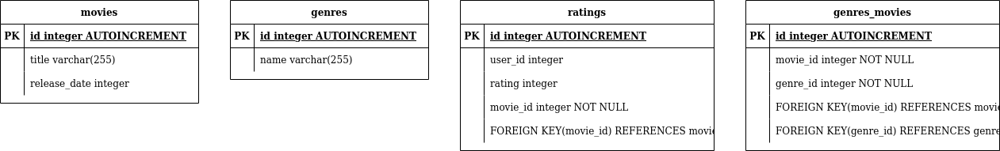

# How to Ingest Data

Download and extract movielens data to folder containing ingest.py. 
```bash
python3 ingest.py --database-path movies_20m.db --data-path "ml-20m"
```
***database-path:*** path of database which will be created

***data-path:*** path of folder which contains movilens data

_Ingest operation can last 10 mins._

# How use Python Api

```python3
from api import MovieRetriever

MovieRetriever.retrieve_movies(db_path="movies_20m.db")
```
"db_path" must be provided.


"rating", "genre", "year" and "sign" are other arguments of "retrieve_movies" function. these are optionals. 
* If any of these are not added than it retrieves all movies in db. 
* If only genre is added than movies with that genre will be retrieved. **e.g.** MovieRetriever.retrieve_movies(db_path="movies_20m.db", genre="Roamnce")
* If rating and genre added than it will retrieve movies that is both in that genre and higher than given rating score. 
* MovieRetriever.retrieve_movies(db_path="movies_20m.db",  sign='=', year=2000, genre="Romance") retrieves Romance movies released after 2000.
*  MovieRetriever.retrieve_movies(db_path="movies_20m.db",  sign='=', year=2000, genre="Romance", rating=4)
retrieves Romance movies with a rating above 4 and also released after 2000 

Sign can be confusing. It is used to determine how the given year compares with the movei release dates. For example:
    
    * MovieRetriever.retrieve_movies(db_path="movies_20m.db", sign='<', year=2000) retrieves movies which were released before 2000.
    * MovieRetriever.retrieve_movies(db_path="movies_20m.db", sign='>', year=2000) retrieves movies which hae been released after 2000.
    * MovieRetriever.retrieve_movies(db_path="movies_20m.db", sign='=', year=2000) retrieves movies which were released at 2000.
    * default value of 'sign' is '>' so MovieRetriever.retrieve_movies(db_path="movies_20m.db",  year=2000) retrieves movies which hae been released after 2000.

> **Note:** Queries with ratings are a bit slower.

> **Note:** Due to queries created programmatically by MovieRetriever.query_builder, if you want to check queries, you can give exact same arguments that you give MovieRetriever.retrieve_movies to MovieRetriever.query_builder except db_path and print them.

# How to Use Rest Api

I developed rest api of movie retriever as a basic interface for python api. It basicly takes arguments from requests endpoint and pass it to "MovieRetriever.retrieve_movies".

"db_path" must be in args. Other than that "rating", "genre", "year" and "sign" can be in endpoint.  

### Example
http://localhost:5000/test?db_path=movies_20m.db&year=2000&sign==&genre=War&rating=3

Api __only__ retrives movies whose genre is 'War' and rating is above '3' and released in 2000.

result:

    {"title":{"0":"Road to Perdition","1":"Country Bears, The","2":"Signs","3":"Ghost Ship","4":"May","5":"Housekeeper, The (femme de m\u00e9nage, Une)","6":"Sea Is Watching, The (Umi wa miteita)","7":"Ash Wednesday","8":"Comic Book Villains","9":"Broken Wings (Knafayim Shvurot)","10":"Wilbur Wants to Kill Himself"}}

http://localhost:5000/test?db_path=movies_20m.db&genre=War&rating=4.99

Api __only__ retrives movies whose genre is 'War' and rating is above '4.99'

result:

    {"title":{"0":"Little Odessa","1":"Second Best","2":"Space Jam","3":"Striptease","4":"Arsenic and Old Lace","5":"High Noon","6":"Parallel Sons","7":"Amityville Horror, The","8":"Jackie Brown","9":"Deep Rising","10":"Jane Austen's Mafia!","11":"Iron Eagle","12":"Monkey Shines","13":"Ape, The","14":"Fisher King, The","15":"Night Tide","16":"Big Tease, The","17":"Kentucky Fried Movie, The","18":"Abbott and Costello Meet Frankenstein","19":"North Shore","20":"House by the Cemetery, The (Quella villa accanto al cimitero)","21":"All Access","22":"Tucker: The Man and His Dream","23":"Little Women","24":"Seconds","25":"Baby's Day Out","26":"Big Bird Cage, The","27":"Road to Perdition","28":"Sex and Lucia (Luc\u00eda y el sexo)","29":"Country Bears, The","30":"Ghost Story","31":"Ghost Ship","32":"Noah's Arc Principle, The (Arche Noah Prinzip, Das)","33":"Zulu","34":"Author! Author!","35":"Champagne for Caesar","36":"Harder They Come, The","37":"May","38":"X2: X-Men United","39":"Bodies, Rest & Motion","40":"Hour of the Pig, The","41":"Housekeeper, The (femme de m\u00e9nage, Une)","42":"Sea Is Watching, The (Umi wa miteita)","43":"Camp","44":"Rules of the Game, The (La r\u00e8gle du jeu)","45":"Last Boy Scout, The","46":"Life with Father","47":"Who's the Man?","48":"Starsky & Hutch","49":"Wilbur Wants to Kill Himself","50":"Boys in the Band, The","51":"Second Skin (Segunda Piel)","52":"Valachi Papers,The","53":"Moment by Moment","54":"That Uncertain Feeling","55":"Cobweb, The","56":"Floating Weeds (Ukigusa)","57":"I Love You, Alice B. Toklas!","58":"Last Summer","59":"Joke, The (Zert)","60":"Claire's Knee (Genou de Claire, Le)","61":"The Identical","62":"The Expedition to the End of the World","63":"Cry, the Beloved Country","64":"Paper Planes","65":"Kolka Cool"}}

http://localhost:5000/test?db_path=movies_20m.db&genre=War

Api __only__ retrives movies whose genre is 'War'.

Its result is a bit longer.


# Notes

I tried to model E-R relations of database more like snowflake. It would be faster if it was modelled as star schema. However, i thought that keeping data as it is given makes it very hard to maintance espacially for genres. For example if adding a new genre were needed, we would only add it to genres table and than insert necessary movies with id of new genre to genres_movies table. 

#### ERD:



Instead of giving "Null" to unknown release years, i insert -1 because i want to utilize auto query creation part of api. You check "query_builder" method in "api.py". 

I was really busy so i did not add error checks when developing api.